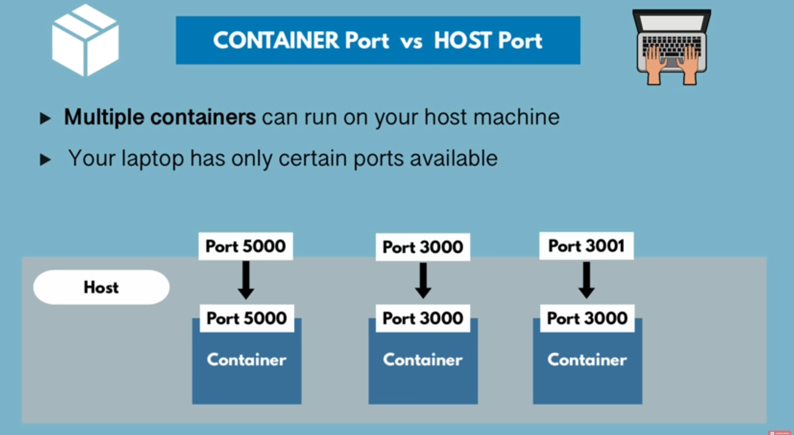

# Docker
These notes are based on [this](https://www.youtube.com/watch?v=3c-iBn73dDE&list=PLkeYVSQZTUZYzBtuUu-49LAr8gI1eNALn&index=9&t=3140s) youtube tutorial 

## Container
- A way to package application with all the necessary dependencies and configurations.
- Container is a layer of images
    - Most of them have Linux image as base image because they are small in size. Mostly Linux alpine because that is lightest
    - For example, an image of postgresql can contain:
        - Linux alpine image
        - some other images
        - postgres application image
    - Container can also be described as running version of the image
    - is a running environment for an image
- A container consists of application image, file system, environment configs
- Portable artifacts, easily moved and shared around
- makes development and deployment more efficient.
- Also has port binding, e.g port 5432 associated with postgres container
- Containers can also be created without docker
- When we search for an artifact on DockerHub we are searching for an image not a container. Container can be called a running environment of an image.
- [Read more](https://www.ibm.com/topics/containers) about containers
- We can start containers for 2 different versions of the same application
- Container can be described as a virtual environment running on a machine
- Containers do not persist data. If a database container is restarted it won't have any data/configurations from previous session
    - But there is a service called `Docker Volumes` for data persistancy

### Container storage/location
- Can be stored in public or private repositories
- Public repositories are hosted on DockerHub

### Need of Containers
- Without container every person who initializes the application in local or production environment, will need to install dependencies.
    - For example, an application may require python, redis, postgresql & Apache as dependencies. There are different binaries/installation packages & process for different environments which will need to be configured first.
    - There are many steps required for setup and things can go wrong at any step. There can be version upgrades which can cause compatibility issues.
    - Lengthy detailed steps can cause confusion & misunderstandings.
- With containers, just download the container and run it.
    - no need to install binaries or dependencies
    - containers have their own isolated environment
    - They are packaged with all needed configuration

### Containers for different versions of same application
Let's say we downloaded different version images of the same application like redis.
- When we run them they run in different containers but same port, how do we connect with them if both are running on same port?
    - In that case we use port binding
    - The running containers on host machine are connected to host machine through ports, a container listening on port 3000 can bind with host machine port 3000. But if there are 2 containers listening on port 3000 then they can not interact/bind with host machine on port 3000, because host machine has only one port 3000. one of the containers need to bind at port 3001 or some different port.
- 

#### Specifying port binding on container start
- `docker run -p<hosting-machine-port>:<container-port> <image-name>`
    - For example: `docker run -p6000:6379 redis`

## Docker Commands
- See all existing images `docker images`
- See all running containers `docker ps`
- Create/Run the from an image in:
    - attached mode `docker run <image_name>` (will run in terminal and can be ended by `Ctrl + c`)
    - detached mode `docker run -d <image_name>`
- Stop the container using `docker stop <Container ID>`
- Start the container `docker start <Conatiner ID>`
    - container will retain configurations defined at the time of docker run
- Get the history of all the containers (ID, Status) `docker ps -a`
- Remove container with certain ID `docker rm <container ID>`
- Remove image with certain ID `docker rmi <IMAGE ID>`

### Debugging
- Check the logs of a container
```
docker logs <container ID>
or
docker logs <container Name>
```

- Name the container on run:
```
docker run -d -p<host-port>:<container-port> --name <custom_name> <image-name>:<version>
docker run -d -p6000:6379 --name lovely-redis redis:6
```

- Connect to terminal of container to check configuration file/logs:
```
docker exec -it <container ID/Name> /bin/bash
docker exec -it thirsty_goodall /bin/bash
```

## Docker Network
- An isolated network which contains docker containers
    - containers can communicate with each other just by using container name
    - applications from host can communicate using port number
    - For example: A docker network may comprise of node.js application, MongoDb, Mongo Express UI
    - Get the list of docker networks: `docker network ls`
    - See useful commands for related to an image on Docker hub
    - Example command:
        ```
        docker run -d \
        --network web_default \
        --name mongo-express \
        -p 8081:8081 \
        -e ME_CONFIG_OPTIONS_EDITORTHEME="ambiance" \
        -e ME_CONFIG_MONGODB_SERVER="web_db_1" \
        -e ME_CONFIG_BASICAUTH_USERNAME="user" \
        -e ME_CONFIG_BASICAUTH_PASSWORD="fairly long password" \
        mongo-express
        ```
    - `-e` stands for environment variable
- we can manually create containers, configure their environment variable and add them to network or use docker compose (next section)
- skipping practical of section `Developing with Containers` at 1:10:08

## Docker compose
- Docker compose is installed alongwith docker, in some cases it needs separate installation
- Always starting containers and attaching them to network manually is tedious we can automate this process using Docker Compose
- Example of manual command:
    ```
    docker run -d \
    --name mongodb \
    -p 27017:27017 \
    - e MONGO-INITDB-ROOT_USERNAME=admin \
    - e MONGO-INITDB-ROOT_USERNAME=password \

    --net mongo-network \
    mongo
    ```
    ```
    docker run -d \
    --name mongo-express \
    -p 8080:8080 \
    - e ME_CONFIG_MONGODB_ADMINUSERNAME=admin \
    - e ME_CONFIG_MONGODB_ADMINPASSWORD=password \
    - e ME_CONFIG_MONGODB_SERVER=mongo \

    --net mongo-network \
    mongo-express
    ```
- Example of Docker compose
    ```
    version:'3'  (version of Docker compose)
    services:
        mongodb  (container name)
            image:mongo
            ports:
                - 27017:27017  (HOST:CONTAINER)(port binding)
            environment:
                - MONGO-INITDB-ROOT_USERNAME=admin
                - MONGO-INITDB-ROOT_USERNAME=password
        mongo-express
            image:mongo-express
            ports:
                - 8080:8080
            environment:
                - ME_CONFIG_MONGODB_ADMINUSERNAME=admin
                - ME_CONFIG_MONGODB_ADMINPASSWORD=password
                - ME_CONFIG_MONGODB_SERVER=mongo
    ```
- Docker Compose takes care of creating Common Network so we don't need to specify network

- Save the configurations in `.yaml` file. To start the network container with docker compose use
```
docker-compose -f <file_name.yaml> up
```

- Stop the containers
```
docker-compose -f <file_name.yaml> down
```
    - also deletes network

## Dockerfile
- Basically a blueprint for building images
- Used to create custom Docker image of our application e.g Django, Node.js etc
- We push our code to github, on CI **jenkins** packages it into a Dockerfile
- See example docker file [here](../example-docker-files/Dockerfile)
- Environment variables can be defined in Dockerfile but it's recommended to define them in docker compose, so, that change can be made easily
- Dockerfile syntaxt:
    - `FROM python:3.10.2` -- define base image for the image
    - `RUN mkdir test` -- RUN allows to run linux commands
    - Check sample Docker file [here](../example-docker-files/Dockerfile)
- image file should always be called `Dockerfile`
- To build image from `Dockerfile`:
    - `docker build -t <image_name>:<version> <path-to-Dockerfile>`
        `-t` used to give image_name & version
    - For example: `docker build -t my-app:1.0 .`

- If an image is build once and you make changes to Dockerfile, the image needs to be built again